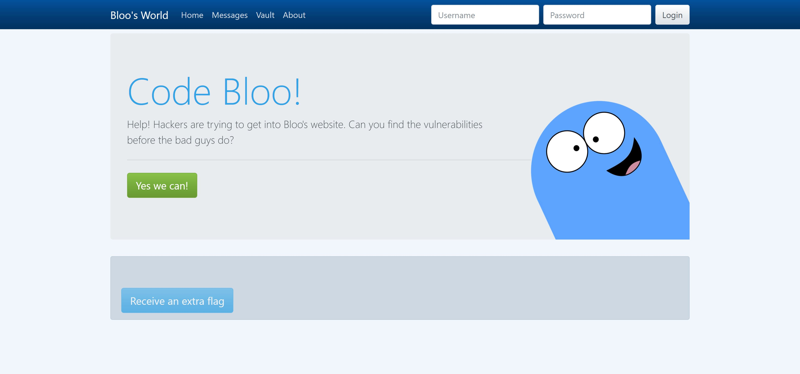
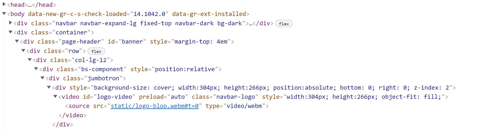
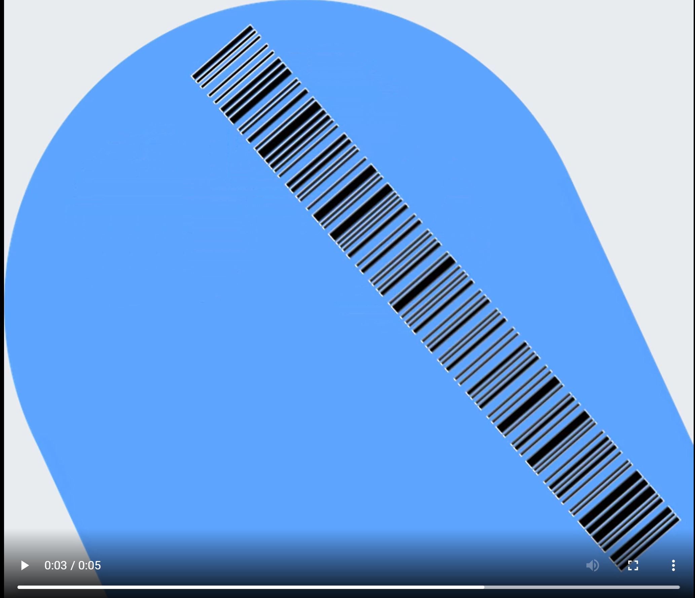

Animate was the second subchallenge for Bloo's World and stated:

_Wait.. an extra flag? That means we missed the first flag! Where could it be?_

So, from the first subchallenge, we know that is will be somewhere on the Home Page.

When looking at the source code, you can see that there is a "logo-video" ID tag, and under it is the blue character seen in the right corner of the Home Page. 

When you veiw the video in a new tab, it plays and at the end, there is a barcode. 

When this barcode is scanned with a phone app, you get:

_CTF{bloo_has_a_barcode}_

