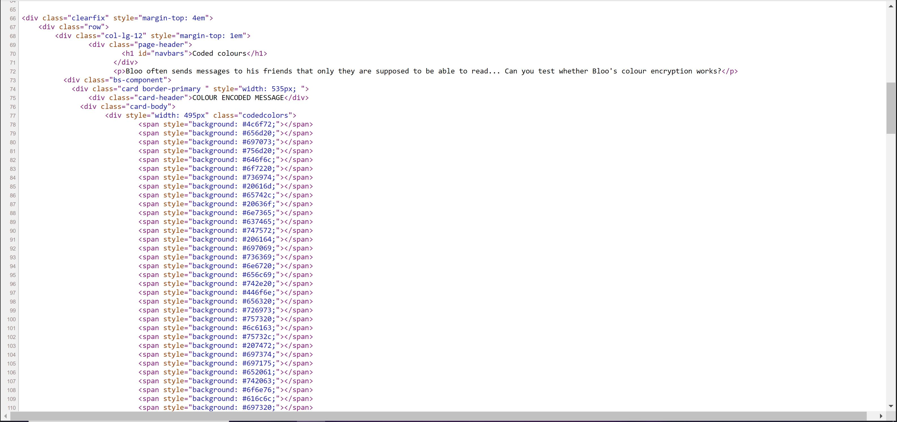

This flag was one of six for a singular challenge called Bloo's World.
The challenge was as follows: 


I then looked at the HTML to see if I could get all the hex color codes.

This is the beginning of the HTML for the color blocks. 



So I then copied all of the lines with the hex codes into a text file, html_base.txt. 

After that, I wrote a python script, code_extraction.py, to extract just the codes from each line and covert from hex and print it out. 

```
#bloos world color code
#Getting the hex color codes from the text file holding the HTML

lines = []

#opens the html_base.txt and sets each line as an object in lines array
with open('html_base.txt') as f:
    lines = f.readlines()

#Read in each entry of lines and get only the 6 characters after the '#'
for line in lines:
    result = line.index('#')
    slice_size = slice(result+1, result+7,1)
    #sets code equal to the needed 6 hex characters
    code = line[slice_size]
    #converts from hex and prints the output
    code_edit1 = bytes.fromhex(code)
    code_edit2 = code_edit1.decode()
    print(code_edit2)

f.close()
```


The first few lines of output are:

```
Lor
em 
ips
um 
dol
or 
sit
 am
et,
 co
nse
cte
tur
 ad
ipi
sci
ng 
eli
t. 
```

But when you scroll to the very bottom of the out put, the last few lines are:

```
C
ong
rat
ula
tio
ns.
.. 
you
 fo
und
 th
e f
lag
: C
TF{
cod
e_b
lue
_re
d_p
urp
le}
```

When this is cleaned up, it reads:

Congratulations... you found the flag: CTF{code_blue_red_purple} 

