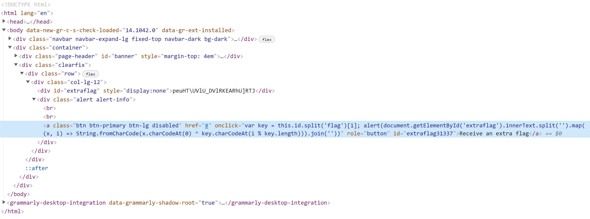
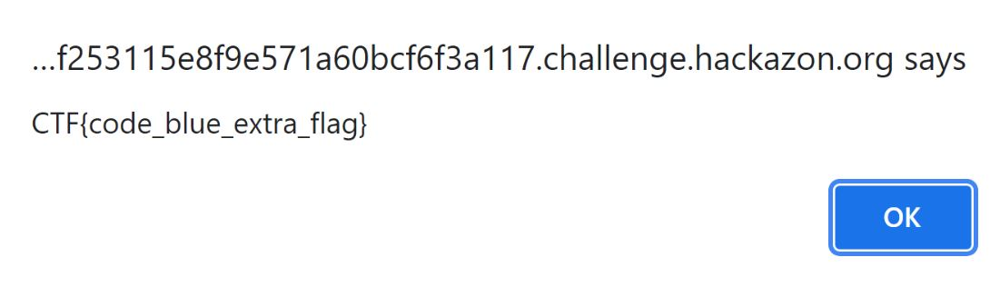

This is the first suchallenge for Bloo's World and it states: 

_Time to warm up! Can you get the extra flag on the home page?_

On the Home Page there is a button that says "Recieve an Extra Flag" but you are unable to press it.


So I looked at the source code to see if I could enable the button. I found the location of the button attributes, and saw that it was listed as a disabled button.




The particlar place I looked at was:

```
<a class="btn btn-primary btn-lg disabled" href="#".....
```

Which I then changed to: 

```
<a class="btn btn-primary btn-lg" href="#"......
```

This allowed me to press the button, which caused a popup at the top of the screen.
    

    
    
