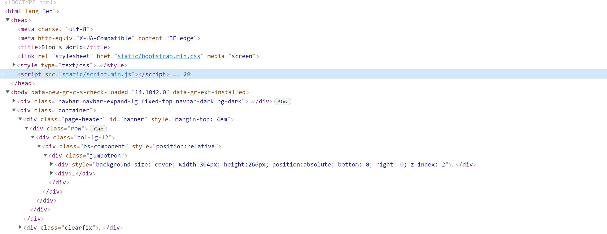
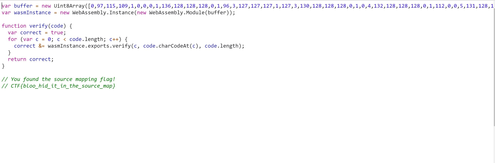

This was the third subchallenge for Bloo's World and it stated:

_Those scripts look damn ugly... surely we can make it look nicer?_

So I look at the source code and in the header of the HTML code there is a JavaScript file. 

Using Google Chrome's Inspect, I open _static/script.min.js_ in the Source tab. 

This shows the flag is in the comments of the file. 
