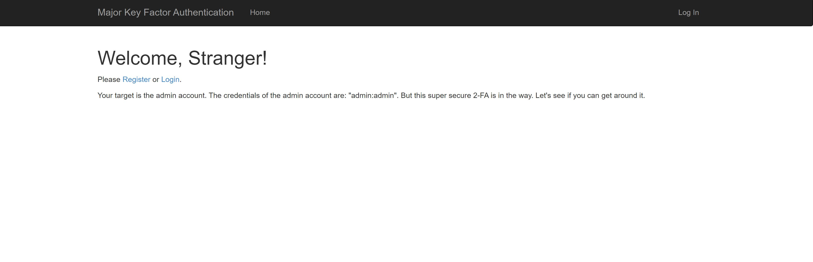
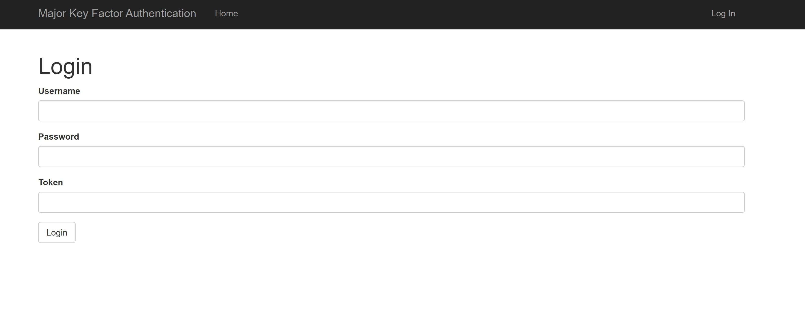
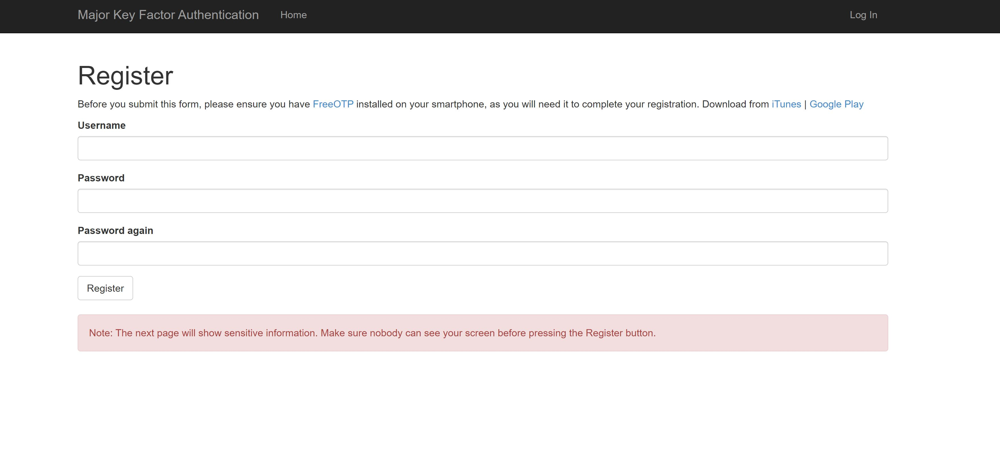
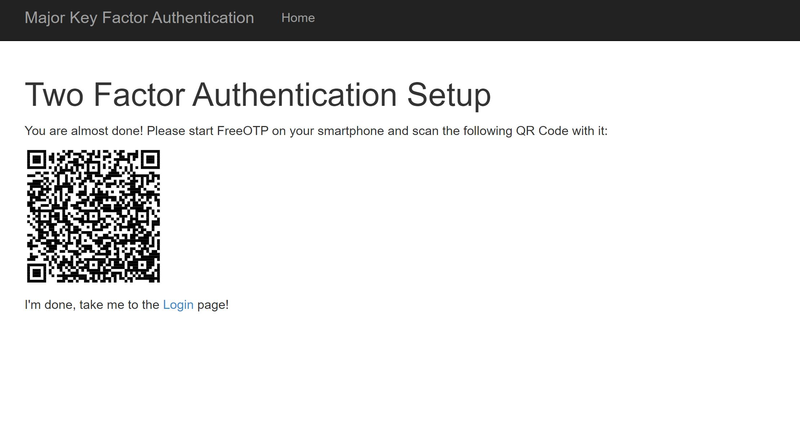
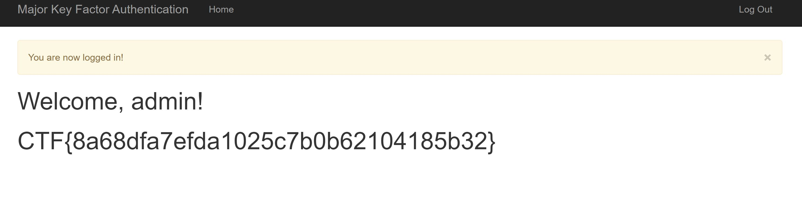

This challenge stated:
_Can you break this secure Two Factor Authentication system and get admin access?_

When accessing the webpage provided the Home Page was the following:

When you clicked on the Login Button in the upper right corner, you are prompted with the following page.

As shown, a username, password and token are needed. The username and password are given on the Home Page as admin and admin, so all that is needed is the token. 

I looked at the Register Page to see how someone gets a token, so I went through the process and made an account on the page below.

When I clicked on Next it took me to this page.

Using an Authenticator app on my phone, I scanned the QR code and got a token. 
I then logged into the account I created but was not able to do anything. So I decided to try and login to the admin account using the given credentials, but my token. 
This allowed me to login and gave me the following page.

