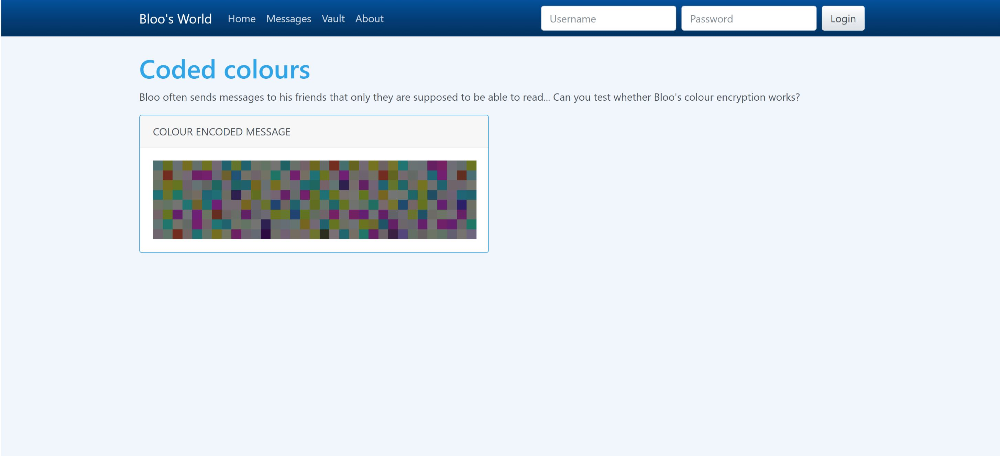
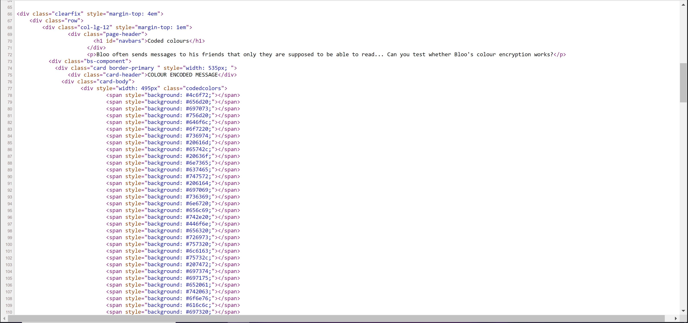

This flag was one of six for a singular challenge called Bloo's World.
The challenge was as follows: 



I then looked at the HTML to see if I could get all the hex color codes.

This is the beginning of the HTML for the color blocks. 



So I then copied all of the lines with the hex codes into a text file, html_base.txt. 

After that, I wrote a python script to exctract just the codes from each line and covert from hex and print it out. 

The first few lines of output are:

```
Lor
em 
ips
um 
dol
or 
sit
 am
et,
 co
nse
cte
tur
 ad
ipi
sci
ng 
eli
t. 
```

But when you scroll to the very bottom of the out put, the last few lines are:

```
C
ong
rat
ula
tio
ns.
.. 
you
 fo
und
 th
e f
lag
: C
TF{
cod
e_b
lue
_re
d_p
urp
le}
```

When this is cleaned up, it reads:

Congratulations... you found the flag: CTF{code_blue_red_purple} 

