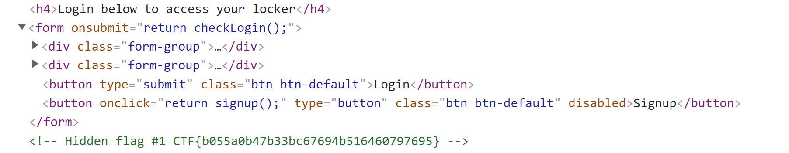
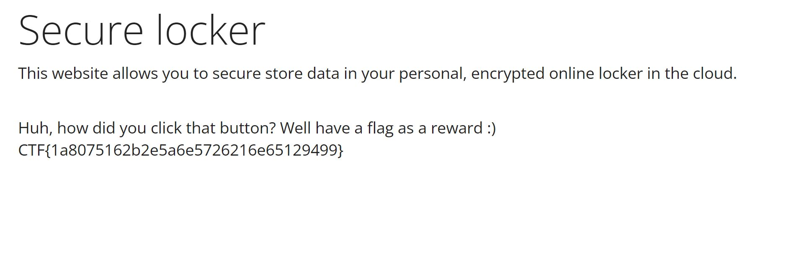

Access the Signup Function stated:
_It seems that the signup button is disabled, can you manage to click it any way?_

So I looked at the HTML to see if I could enable the button, since on the Home Page it was disabled, but present. 


When looking at the HTML, right above the comment that contains the flag for the first subchallenge, there is the code for the Sign Up button. 



The line that I looked at was: 

```
<button onclick="return signup();" type="button" class="btn btn-default" disabled>Signup>/button>
```

I then changed this line to read:

```
<button onclick="return signup();" type="button" class="btn btn-default" enable>Signup>/button>
```

This allowed me to click the button, which changed the page to the following:


